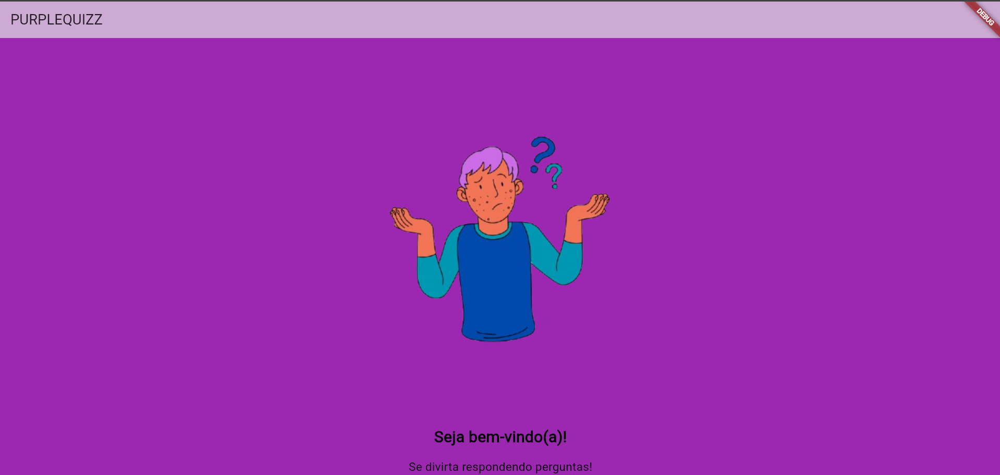

# 🟣 PurpleQuizz 🟣
<p>
  O PurpleQuizz é um aplicativo de quiz simples e divertido que apresenta perguntas aleatórias sobre curiosidades. 
  Uma pergunta é apresentada na tela, o usuário responde a pergunta e, ao final, pode visualizar na tela se errou ou não, podendo reiniciar e tentar uma nova pergunta.
</p>
<p>
  O objetivo principal do aplicativo é proporcionar uma forma rápida e interativa de aprender curiosidades enquanto se diverte. A predominante cor roxa, que intitula o aplicativo "PurpleQuizz" tem como objetivo associar ao mistério e a criatividade, características importantes que compõem o funcionamento da aplicação. 
</p>
 🚀 Funcionalidades

- Apresenta perguntas aleatórias sobre curiosidades gerais.
- Mostra o resultado ao final de cada pergunta.
- Interface simples e intuitiva.
- Reinício fácil para jogar novamente.

---

## 📲 Telas do Aplicativo

### 🖼️ Tela 1 – Splash Screen
Aqui temos nossa Splash Screen contendo a logo da aplicação, tela de curta duração que direciona para o cadastro e login



---

### 🖼️ Tela 2 – [Nome da tela]
_Descrição da segunda tela._


---

### 🖼️ Tela 3 – [Nome da tela]
_Descrição da terceira tela._


---

### 🖼️ Tela 4 – [Nome da tela]
_Descrição da quarta tela._


---

## 🛠️ Instalação e Execução

Siga os passos abaixo para instalar e executar o PurpleQuizz no seu ambiente local:

### ✅ Pré-requisitos

- [Node.js](https://nodejs.org/) (versão recomendada: LTS)
- Gerenciador de pacotes como `npm` ou `yarn`

### 💻 Passos

```bash
# Clone o repositório
git clone https://github.com/seu-usuario/purplequizz.git

# Acesse o diretório do projeto
cd purplequizz

# Instale as dependências
npm install

# Execute o aplicativo em modo de desenvolvimento
npm start

