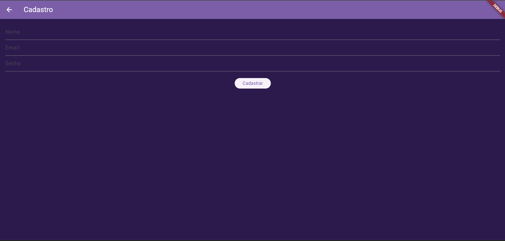
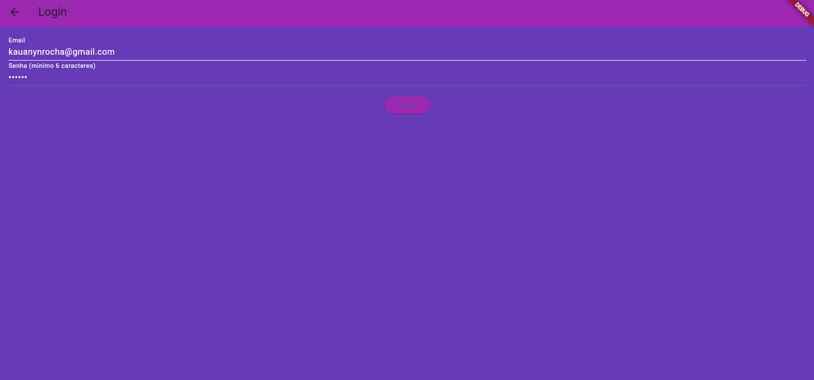

# 🟣 PurpleQuizz 🟣
<p>
  O PurpleQuizz é um aplicativo de quiz simples e divertido que apresenta perguntas aleatórias sobre curiosidades. 
  Uma pergunta é apresentada na tela, o usuário responde a pergunta e, ao final, pode visualizar na tela se errou ou não, podendo reiniciar e tentar uma nova pergunta.
</p>
<p>
  O objetivo principal do aplicativo é proporcionar uma forma rápida e interativa de aprender curiosidades enquanto se diverte. A predominante cor roxa, que intitula o aplicativo "PurpleQuizz" tem como objetivo associar ao mistério e a criatividade, características importantes que compõem o funcionamento da aplicação. 
</p>
 🚀 Funcionalidades

- Apresenta perguntas aleatórias sobre curiosidades gerais.
- Mostra o resultado ao final de cada pergunta.
- Interface simples e intuitiva.
- Reinício fácil para jogar novamente.

---

## 📲 Telas do Aplicativo

### 🖼️ Tela 1 – Splash Screen
Aqui temos nossa Splash Screen contendo a logo da aplicação, tela de curta duração que direciona para o cadastro e login.


---

### 🖼️ Tela 2 – Cadastro
Aqui o usuário fará seu cadastro incluindo os dados solicitados, a aplicação enviará os dados para o firebase.



---

### 🖼️ Tela 3 – Login
Após a autenticação dos dados no banco, o usuário pode efetuar seu login, que o direcionará para a tela inicial da aplicação.



---

### 🖼️ Tela 4 – Tela Principal (Perguntas)
Nesta tela temos a exibição das perguntas que devem ser respondidas pelo usuário, após a resposta é apresentada uma mensagem de acerto ou erro!


---

## 🛠️ Instalação e Execução

Siga os passos abaixo para instalar e executar o PurpleQuizz no seu ambiente local:

### 💻 Passos

```bash
# Clone o código do repositório
git clone https://github.com/kakaufoc/purplequizz.git

# Acesse o diretório do projeto
cd purplequizz

# Instale as dependências
npm install

# Execute o aplicativo em modo de desenvolvimento
npm start

